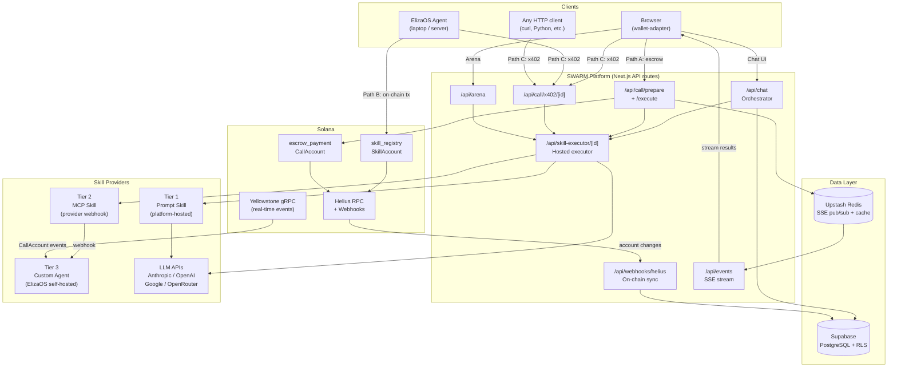
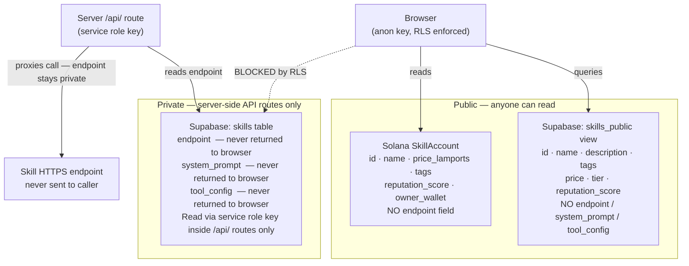
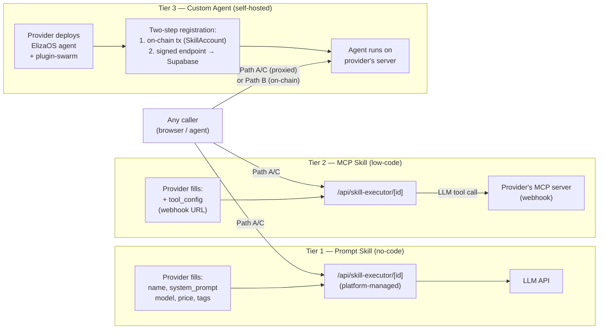
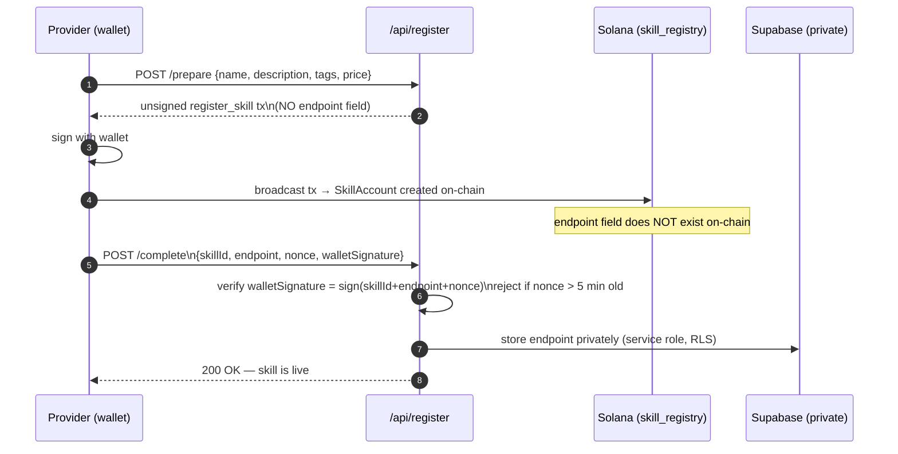
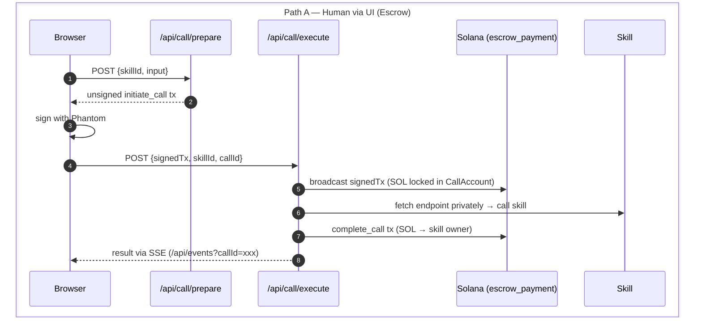
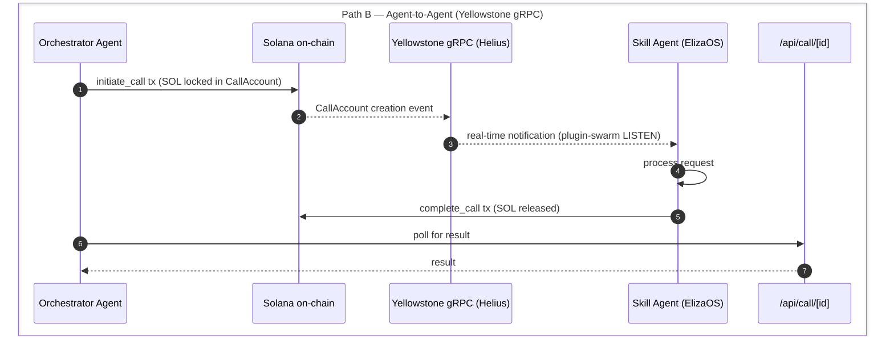
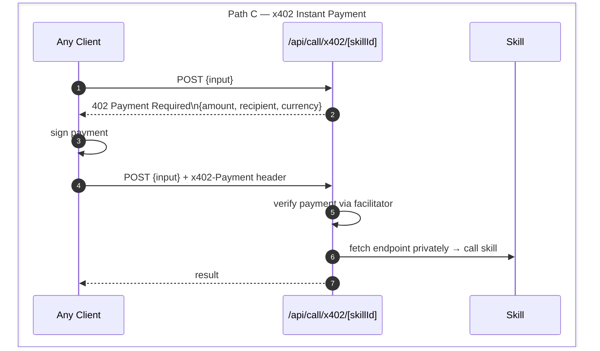
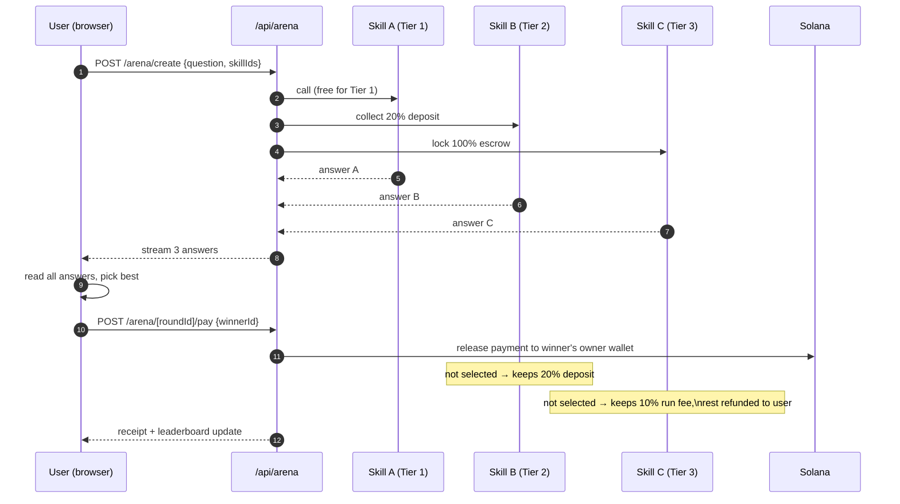

# SWARM Marketplace

An open platform for AI skill discovery, payment, and reputation on Solana. Anyone can publish an AI skill and earn SOL per call. Anyone can browse, compare, and pay only for the answers that help them.

---

## What's Built

| Area | Status | Notes |
|---|---|---|
| Next.js 15 frontend | ✅ | App Router, TypeScript, Tailwind, shadcn/ui |
| Multi-provider LLM routing | ✅ | Anthropic, OpenAI, Google, OpenRouter |
| SWARM Orchestrator chat | ✅ | Discovers skills, fetches live data, web search |
| Skill marketplace | ✅ | Browse, filter, featured strip, category pills |
| Skill executor (Tier 1 + 2) | ✅ | Hosted prompt skills + MCP tool skills |
| Arena (compare & pay) | ✅ | Multiple skills answer one query, pay for the best |
| Leaderboard | ✅ | Skills ranked by reputation, calls, SOL earned |
| Creator dashboard | ✅ | Earnings, skills, recent calls, ratings |
| Dual-audience homepage | ✅ | Clear user vs creator entry paths |
| Supabase schema + RLS | ✅ | Endpoint privacy enforced |
| Smart contracts | 🚧 | Anchor programs (skill_registry + escrow_payment) |
| x402 instant payments | 🚧 | Path C micro-payment endpoint |
| ElizaOS plugin | 🚧 | DISCOVER_SKILLS, CALL_SKILL, LISTEN, COMPLETE |
| Helius webhook indexer | 🚧 | On-chain event sync |

---

## Architecture

### System Overview



### Endpoint Privacy (Critical)

Skill endpoint URLs are **never stored on-chain**. Anyone calling `getProgramAccounts` on Solana can read all fields of a `SkillAccount` — if the endpoint were on-chain, competitors could call skills directly and bypass payment entirely.



```
On-chain (SkillAccount):     id, name, price, reputation — NO endpoint field
Supabase skills table:       endpoint, system_prompt, tool_config — private, server-side only
Supabase skills_public view: safe subset — served to browser
```

All endpoint reads use the Supabase **service role key** (server-side API routes only, never in browser code). The `skills_public` view explicitly excludes `endpoint`, `system_prompt`, and `tool_config`.

### Three Skill Tiers



**Tier 3 Registration (two-step):**



### Three Call Paths







### Multi-Provider LLM

All LLM calls route through `src/lib/ai-providers.ts`. Set defaults via env:

```bash
LLM_DEFAULT_PROVIDER=openrouter   # anthropic | openai | google | openrouter
LLM_DEFAULT_MODEL=meta-llama/llama-4-maverick
```

Individual skills can override with their own `model_config`. If a skill's configured provider has no API key, it automatically falls back to the platform default — skills never hard-crash due to misconfigured model settings.

When `LLM_DEFAULT_PROVIDER=google`, native Google Search grounding activates automatically in the Orchestrator (no Tavily key needed).

### Arena Economics



The Arena lets users compare answers from multiple skills and pay only for the one that actually helped. Costs vary by tier so creators are always compensated for running:

| Tier | Upfront cost | If selected | If not selected |
|---|---|---|---|
| Tier 1 (Prompt) | Free — platform subsidizes LLM token cost | Pay full `price_lamports` | Nothing owed |
| Tier 2 (MCP) | 20% deposit per skill | Pay remaining 80% | Provider keeps 20% deposit |
| Tier 3 (Agent) | 100% escrow per skill | Provider keeps full payment | 10% run fee, rest refunded |

Arena rounds are **private** — only the wallet that created the round can pay for an answer. The round lives in the creator's dashboard, not a public feed.

---

## Repo Structure

```
swarm-marketplace/
├── apps/web/                        # Next.js 15 — frontend + all API routes
│   └── src/
│       ├── app/
│       │   ├── page.tsx             # Homepage (dual-path: users vs creators)
│       │   ├── marketplace/         # Skill discovery (App Store style)
│       │   ├── chat/                # SWARM Orchestrator chat UI
│       │   ├── arena/               # Compare skills, pay for best answer
│       │   ├── leaderboard/         # Skills ranked by reputation
│       │   ├── dashboard/           # Creator + user dashboard (includes Arena)
│       │   ├── create/              # Publish a Tier 1/2 skill (no-code)
│       │   ├── register/            # Register a Tier 3 custom agent
│       │   └── api/
│       │       ├── chat/            # Orchestrator: discover + call + live data + web search
│       │       ├── skills/          # GET listing, GET by id
│       │       ├── skill-executor/  # POST internal hosted executor (Tier 1+2)
│       │       ├── create-skill/    # POST single-step Tier 1+2 creation
│       │       ├── register/        # POST prepare + complete (Tier 3)
│       │       ├── call/            # POST prepare, execute; GET result
│       │       ├── call/x402/       # POST Path C instant payment
│       │       ├── arena/           # GET rounds (wallet-filtered); POST create
│       │       ├── arena/[roundId]/ # GET round with entries; POST pay
│       │       ├── webhooks/helius  # POST on-chain event sync
│       │       ├── events/          # GET SSE stream (Redis pub/sub)
│       │       ├── dashboard/       # GET provider earnings
│       │       └── pyth/sol-usd     # GET real-time SOL/USD
│       ├── components/
│       │   ├── ArenaEntryCard.tsx   # Answer card with pay button (creator-only)
│       │   ├── SkillCard.tsx        # Marketplace skill card
│       │   ├── RoundCard.tsx        # Arena round summary card
│       │   └── layout/Navbar.tsx    # Split nav: Use (user) vs Build (creator)
│       └── lib/
│           ├── ai-providers.ts      # Multi-provider LLM routing with auto-fallback
│           ├── supabase.ts          # anon client (browser) + service-role client (server)
│           └── format.ts            # SOL formatting, tier labels, etc.
├── packages/
│   ├── contracts/                   # Anchor workspace (skill_registry + escrow_payment)
│   ├── plugin-swarm/                # ElizaOS plugin for SWARM agents
│   └── skill-template/              # Self-hosted Tier 3 agent starter kit
├── demo/
│   ├── orchestrator-agent/
│   ├── skill-price-agent/
│   ├── skill-news-agent/
│   └── skill-sentiment-agent/
├── scripts/
│   ├── seed-skills.ts
│   ├── seed-finance-skills.ts       # 5 finance skills (Stock Analyst, etc.)
│   └── seed-more-skills.ts          # 22 general skills
├── docker-compose.yml               # Local: Postgres + Redis
├── CLAUDE.md                        # Claude Code project instructions
└── pnpm-workspace.yaml
```

> **No `apps/indexer/` service.** Helius Webhooks push on-chain events directly to `/api/webhooks/helius`. The separate polling indexer is eliminated.

---

## Local Dev

### Prerequisites

- Node.js 20+, pnpm 9+
- Docker (Postgres + Redis)
- Solana CLI + `solana-test-validator` (for smart contract work)

### Setup

```bash
git clone https://github.com/windyinwind/swarm-marketplace
cd swarm-marketplace
pnpm install

# Start local infra
docker compose up -d

# Configure env
cp apps/web/.env.example apps/web/.env.local
# Edit apps/web/.env.local — fill in keys below

# Start frontend
cd apps/web && pnpm dev
```

### Environment Variables

```bash
# apps/web/.env.local

# Public (safe for browser)
NEXT_PUBLIC_SOLANA_RPC=https://api.devnet.solana.com
NEXT_PUBLIC_SUPABASE_URL=
NEXT_PUBLIC_SUPABASE_ANON_KEY=
NEXT_PUBLIC_APP_URL=http://localhost:3333

# LLM — pick one provider (or multiple for skills to choose from)
LLM_DEFAULT_PROVIDER=openrouter       # anthropic | openai | google | openrouter
LLM_DEFAULT_MODEL=meta-llama/llama-4-maverick

OPENROUTER_API_KEY=                   # openrouter.ai
ANTHROPIC_API_KEY=                    # console.anthropic.com
OPENAI_API_KEY=                       # platform.openai.com
GOOGLE_GENERATIVE_AI_API_KEY=         # aistudio.google.com — also enables native search grounding

TAVILY_API_KEY=                       # tavily.com — web search (not needed if using Google provider)

# Private (server-side only — never NEXT_PUBLIC_)
SUPABASE_SERVICE_ROLE_KEY=
INTERNAL_API_KEY=                     # random secret, used for inter-route auth
HELIUS_API_KEY=
HELIUS_WEBHOOK_SECRET=
UPSTASH_REDIS_REST_URL=
UPSTASH_REDIS_REST_TOKEN=
PLATFORM_FEE_BPS=500
```

### Seed Skills

```bash
cd apps/web
npx tsx scripts/seed-skills.ts
npx tsx scripts/seed-finance-skills.ts
npx tsx scripts/seed-more-skills.ts
```

---

## Demo Script

```
1. Homepage
   → Two clear entry paths: "Browse Skills" (user) and "Publish a Skill" (creator)

2. Marketplace
   → Category pills, featured strip, 27+ live skills
   → Click "Stock Analyst" → try it

3. Chat (SWARM Orchestrator)
   → Ask: "Should I invest in NVIDIA?"
   → Watch: fetches live NVDA price, discovers skills, calls Stock Analyst,
     synthesizes answer with markdown formatting

4. Arena (in Dashboard after connecting wallet)
   → Ask a question → 3 skills answer in parallel
   → Read all answers → pay for the one that helped
   → SOL goes directly to that skill's creator

5. Dashboard
   → Earnings, active skills, recent calls, pending ratings

6. Create Skill (no-code)
   → Fill form → connect wallet → skill live in 30s

7. Terminal demo
   → Run orchestrator agent
   → Ask: "What's the outlook for crypto this week?"
   → Watch: agent discovers skills on-chain, pays each via x402, synthesizes result
   → Solana Explorer: 3 payment txs settled
```

---

## Key Design Decisions

**Why no endpoint on-chain?**
`getProgramAccounts` is public — storing the endpoint there lets anyone bypass payment and call skills directly. The platform is the only authorized proxy. Endpoint lives in Supabase behind RLS, readable only with the service-role key.

**Why Helius instead of a custom indexer?**
Helius Webhooks push `SkillAccount`/`CallAccount` change events directly to the API route. No separate always-on service needed, no polling, less operational complexity.

**Why tiered Arena pricing?**
Tier 1 skills cost fractions of a cent to run — the platform subsidizes this for discovery value. Tier 2/3 skills have real server costs the provider pays out of pocket — they need a run fee even when not selected, otherwise there's no incentive to participate in Arena rounds.

**Why multi-provider LLM?**
Different tasks suit different models. Skills can specify their preferred model. The platform falls back to the default if a provider key is missing — no hard failures.

---

## Tech Stack

| Layer | Technology |
|---|---|
| Smart Contracts | Anchor 0.30.x / Rust 1.79+ |
| Frontend | Next.js 15 (App Router) + TypeScript 5 + Tailwind + shadcn/ui |
| Wallet | @solana/wallet-adapter-react (Phantom, Solflare, Backpack) |
| Blockchain Client | @solana/web3.js v2 + @coral-xyz/anchor 0.30.x |
| Database | Supabase (PostgreSQL 16) with RLS |
| Cache + Pub/Sub | Upstash Redis |
| RPC + Webhooks | Helius |
| Real-time Streaming | Yellowstone gRPC (via Helius) |
| Price Oracle | Pyth Network (SOL/USD) |
| Live Market Data | Yahoo Finance API + CoinGecko (no key needed) |
| Web Search | Tavily API or Google native search grounding |
| Instant Payments | x402-solana TypeScript SDK |
| Agent Framework | ElizaOS 1.7.x + Solana Agent Kit |
| LLM | Anthropic / OpenAI / Google / OpenRouter (configurable) |
| Package Manager | pnpm 9.x (workspace) |
